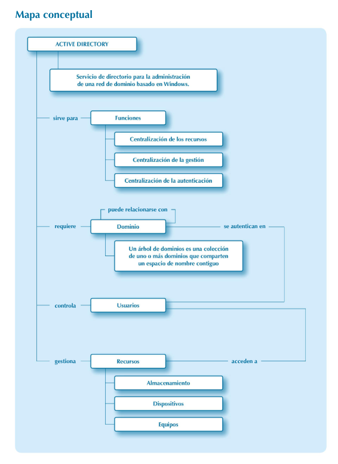

# **EXERCICI RA01.2 - Esquema i estructura d’un Servei de Directori AD/LDAP**

<br>
<br>

# **1. Identificació de components de l’esquema**

### **1.1. Mira el següent DN i identifica cada component:**

```
uid=mpuig,ou=Professorat,ou=Departament,dc=ins-torreraja,dc=cat
```

Respon:

a) Quin és el **RDN**?  
b) Quines són les **OUs**?  
c) Quina és l’**arrel del domini (DC)**?  
d) On viuria aquest objecte dins del DIT? (Representa-ho com un arbre.)  

<br>
<br>

# **2. Comparació AD vs LDAP segons el mapa conceptual**

A partir del mapa conceptual



### **2.1. Digues tres funcions bàsiques d’un servei de directori.**

* 
* 
* 

Després contesta:

**2.2. Existeixen també en un directori LDAP? Explica per què.**

<br>
<br>

#  **3. Anàlisi de classes d’objecte (objectClass)**

Tens la següent definició d’una classe d’objecte de LDAP (capítol 8):

```
objectClass ( 2.16.840.1.113730.3.2.2
  NAME 'inetOrgPerson'
  SUP organizationalPerson
  STRUCTURAL
  MUST ( cn $ sn )
  MAY ( mail $ uid $ telephoneNumber )
)
```

Respon:

a) Quin tipus de classe és? (Estructural / Auxiliar / Abstracta)  
b) Quins atributs **obligatoris** té?  
c) Quins atributs **opcionals** té?  
d) Quin seria un **exemple real** de valor per a `cn`, `sn` i `mail`?  
e) Aquest objecte existiria també en AD? Justifica la resposta  

<br>
<br>

#  **4. Definició d’atributs (attributetype)**

A partir d’aquesta definició d’atribut del capítol 8:

```
attributetype ( 2.5.4.3
  NAME 'cn'
  DESC 'Common Name'
  SYNTAX 1.3.6.1.4.1.1466.115.121.1.15
  SINGLE-VALUE )
```

Respon:

a) Quina és la sintaxi utilitzada?  
b) Per què és important saber si és `SINGLE-VALUE` o `MULTI-VALUE`?  
c) Posa un exemple de valor vàlid i un exemple de valor invàlid segons la sintaxi  
d) AD utilitza aquest mateix atribut internament? Explica-ho  

<br>
<br>

#  **5. Creació d’un objecte d’usuari (mix AD + LDAP)**

Et donem la següent informació d’un usuari d’empresa:

* Nom: **Laura Pujol**
* Usuari: **lpujol**
* Departament: **Informàtica**
* Rol: **Professora**
* Correu: **lpujol@ins-torreroja.cat**

### **5.1. Escriu el DN correcte d’aquest usuari en LDAP**

(Suposa que forma part del domini `ins-torreroja.cat`.)

### **5.2. Escriu com quedaria l’usuari en un LDIF** (només atributs bàsics):

```
dn: ...
objectClass: inetOrgPerson
cn: ...
sn: ...
uid: ...
mail: ...
```

### **5.3. Escriu quins objectes crearies a AD per representar la mateixa estructura del cas anterior**

(OU, usuari, grups, etc.)

<br>
<br>

#  **6. Mini cas pràctic de reflexió (AD + LDAP)**

Contesta:

a) Per què en AD podem tenir un usuari amb `sAMAccountName`, però en LDAP utilitzem `uid`?  
b) Per què LDAP permet múltiples objectClasses però AD no?  
c) Quins avantatges té AD per grans entorns i quins avantatges té LDAP?  

