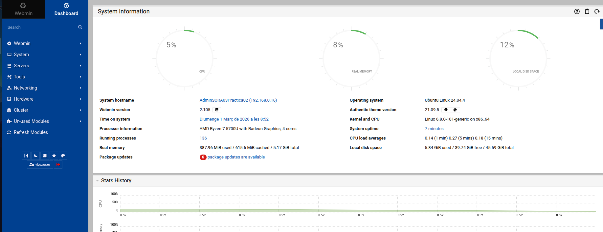
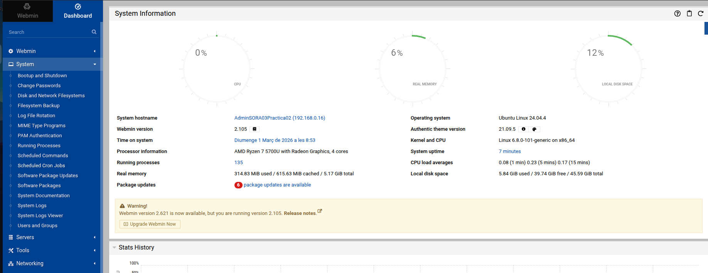
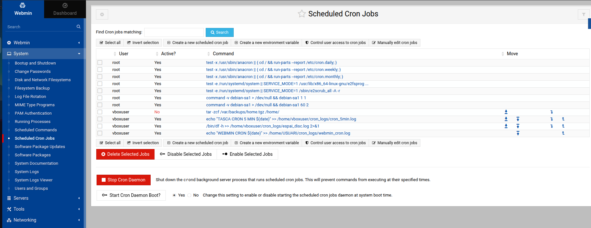
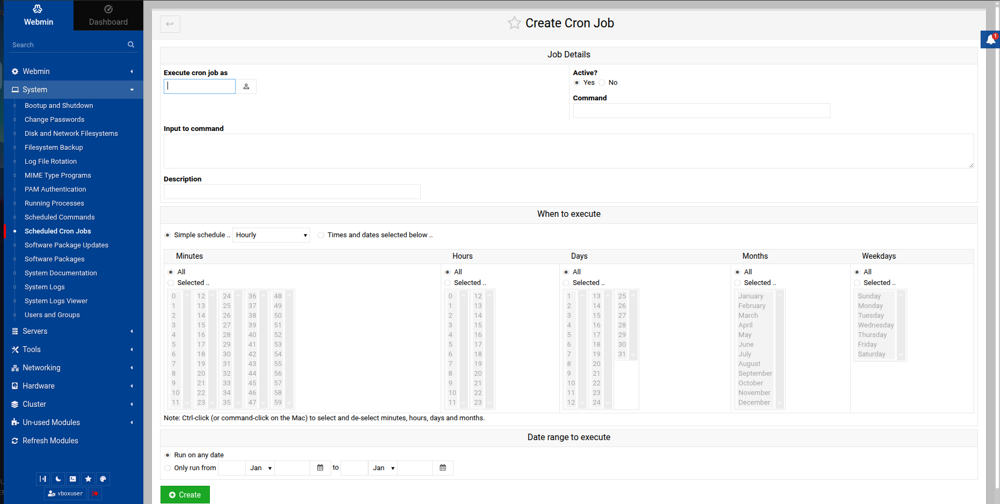
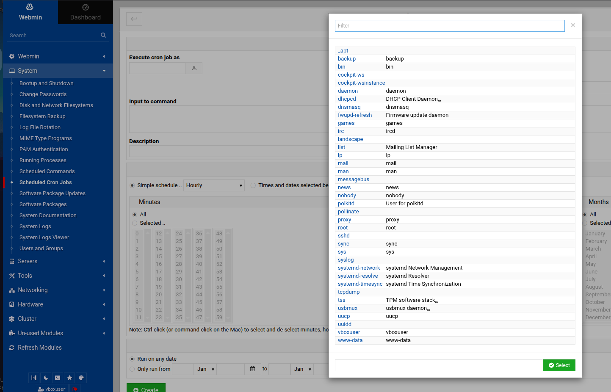
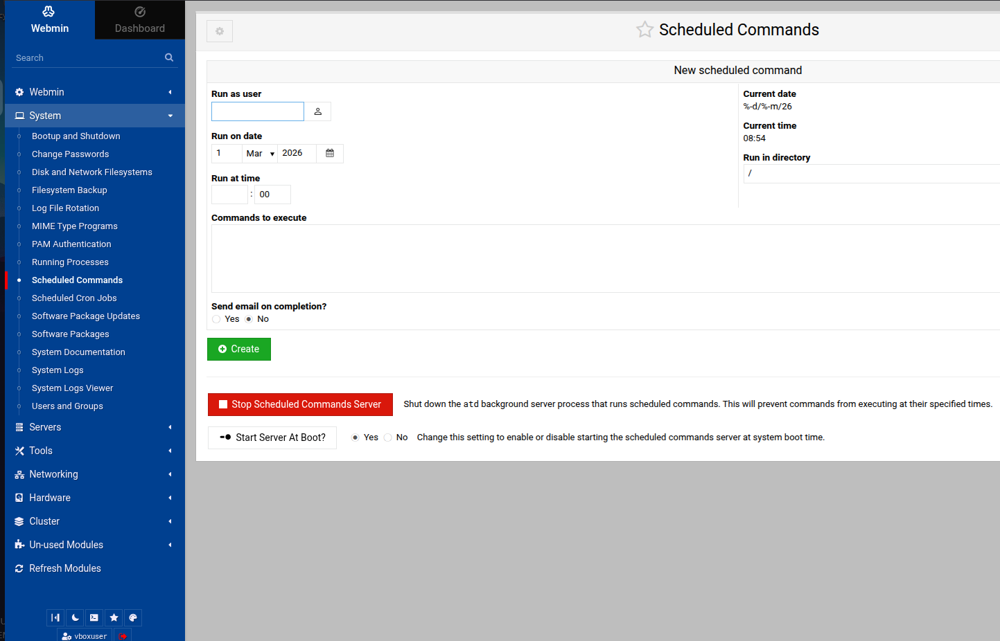
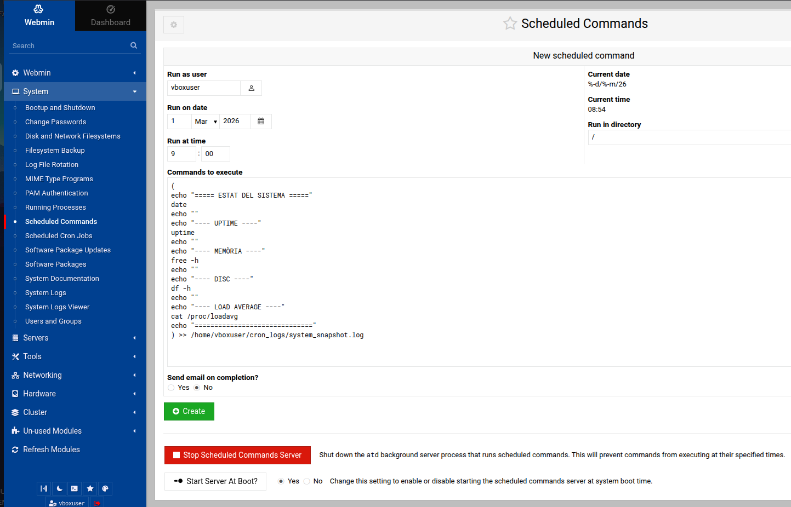
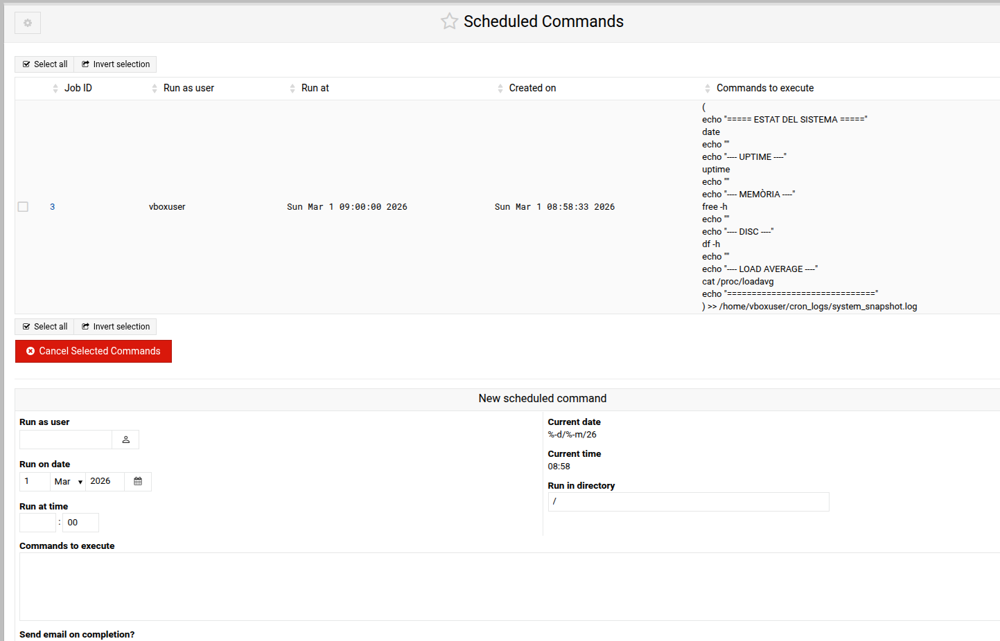

# Imatges referemciades

* **Imatge 1**: System Information (Dashboard amb info del sistema)
* **Imatge 2**: Menú *System* desplegat (on es veuen Scheduled Commands / Scheduled Cron Jobs)
* **Imatge 3**: Llista de *Scheduled Cron Jobs* (ja es veuen tasques creades)
* **Imatge 4**: Pantalla *Create Cron Job* (formulari per crear una tasca cron)
* **Imatge 5**: Popup per triar usuari (llista d’usuaris: root, vboxuser, www-data…)
* **Imatge 6**: Pantalla *Scheduled Commands* (crear una tasca puntual tipus “at”)
* **Imatge 7**: *Scheduled Commands* amb el text llarg enganxat (snapshot sistema) abans de crear
* **Imatge 8**: Llista de *Scheduled Commands* amb la tasca ja creada (Job ID 3)

---

# 0. Accés

## 0.1 Accés a Webmin

1. Entra a: `https://IP_DEL_SERVIDOR:10000` des de client  
2. Inicia sessió amb un usuari de Ubuntu Server

## 0.2 Recordatori clau (hora del servidor)

La data/hora que poses a Webmin és la **del servidor**

* Pots mirar-la al Dashboard  on posa **Time on system**
* O bé per consola:

```bash
date
```

# 1. Identificar les seccions del menú  

Barra lateral esquerra:

1. Obre el menú **System** 
2. Dins de **System**, les dues seccions que ens interessen són:

* **Scheduled Cron Jobs** → per tasques **repetitives** (cron)
* **Scheduled Commands** → per tasques **puntuals** (at)

# 2. TASCA CRON (cada 5 minuts) amb Webmin

## 2.1 Accedir al generador de tasques cron

1. Ves a **System → Scheduled Cron Jobs** 
2. Hauries d’arribar a la llista de tasques cron 

A la **Imatge 3** tens:

* Una taula amb columnes: **User**, **Active?**, **Command**…
* Botó a dalt: **Create a new scheduled cron job**

## 2.2 Crear una tasca nova 

1. Clica **Create a new scheduled cron job** 
2. Entraràs al formulari **Create Cron Job** 

A completar:

### 2.2.1 Execute cron job as (usuari)

* Clica la icona del costat per seleccionar usuari
* Se t’obrirà el selector 
* Tria **vboxuser** i fes **Select** 

> Recordeu el Principle of Least Privilege - PoLP - Principi de mínim privilegi donat a al teoria

### 2.2.2 Command (comanda)

Al camp **Command** :

```bash
echo "WEBMIN CRON $(date)" >> /home/vboxuser/cron_logs/webmin_cron.log
```

### 2.2.3 When to execute (cada 5 minuts)

A **When to execute** , tens dues maneres:

**Opció simple**

* A “Simple schedule” busca una opció tipus **Every 5 minutes**

**Opció manual**

* Selecciona minuts: **0, 5, 10, 15, 20, ... 55**

  * (has de fer Ctrl+click per seleccionar múltiples minuts; Webmin ho recorda al peu del formulari)   
  * si selecciones només 5, ho efectuarà al minut 5 de cada hora: 10:05, 11:05, 12:05...

### 2.2.4 Create

Finalment clica **Create** (botó verd a baix) 

## 2.4 Verificar des de Webmin que s’ha creat bé

1. Tornaràs a la llista de *Scheduled Cron Jobs* 
2. Has de veure una fila nova amb:

   * **User:** vboxuser
   * **Active?:** Yes
   * **Command:** la línia `echo "WEBMIN CRON $(date)" >> ...`

## 2.5 Verificar que s’executa i crea el fitxer (log)

El fitxer **no apareix fins que s’executa la primera vegada**

Per comprovar-ho, tens 2 opcions:

### Opció A - CLI
```bash
ls -l /home/vboxuser/cron_logs/
cat /home/vboxuser/cron_logs/webmin_cron.log
```

### Opció B - Webmin

* Busca el mòdul **File Manager** a Webmin (segons la instal·lació pot estar a *Tools* o *Others*)
* Navega a `/home/vboxuser/cron_logs/`
* Obre `webmin_cron.log`

---

# 3. TASCA “AT” (una sola vegada) amb Webmin

Això NO es fa a “Scheduled Cron Jobs”
Es fa a **Scheduled Commands**

## 3.1 Entrar a Scheduled Commands

1. Ves a **System → Scheduled Commands** 
2. Et sortirà la pantalla per crear una comanda programada 

A la **Imatge 6** veus:

* **Run as user**
* **Run on date**
* **Run at time**
* **Commands to execute**
* Botó verd **Create**
* I a sota: **Start Server At Boot?**

## 3.2 Important: comprovar que el “servidor d’at” està actiu

A la part de baix  hi ha l’opció:

* **Start Server At Boot?** → posa-ho a **Yes**

Això fa que el servei que executa aquestes tasques puntuals arrenqui automàticament

> Si això no està actiu, pots crear la tasca però després no s’executarà

## 3.3 Crear una tasca puntual “estat del sistema”  

A la pantalla de **Scheduled Commands** :

### 3.3.1 Run as user

* Posa **vboxuser** 

### 3.3.2 Run on date / Run at time

* Posa la data i hora d’execució (Imatge 7/8)
* Exemple: avui a les **09:00**

Recorda: és **l’hora del servidor** (ho veus a la dreta a “Current time” )

### 3.3.3 Commands to execute

Enganxa aquest bloc :

```bash
(
echo "===== ESTAT DEL SISTEMA ====="
date
echo ""
echo "--- UPTIME ---"
uptime
echo ""
echo "--- MEMÒRIA ---"
free -h
echo ""
echo "--- DISC ---"
df -h
echo ""
echo "--- LOAD AVERAGE ---"
cat /proc/loadavg
echo "=============================="
) >> /home/vboxuser/cron_logs/system_snapshot.log
```

* Executa diverses comandes (date, uptime, free, df…)
* I ho desa TOT junt a un fitxer log: `/home/vboxuser/cron_logs/system_snapshot.log`

### 3.3.4 Create

Clica **Create** (botó verd) 

## 3.4 Verificar que la tasca puntual s’ha creat

Un cop creada, Webmin et mostra la llista de tasques programades 

A la **Imatge 8**:

* **Job ID** (ex: 3)
* **Run as user**: vboxuser
* **Run at**: la data/hora programada
* I a la dreta el contingut de **Commands to execute**

## 3.5 Verificar que s’ha executat i ha creat el log

Després de l’hora programada:

### Opció CLI

```bash
ls -l /home/vboxuser/cron_logs/
cat /home/vboxuser/cron_logs/system_snapshot.log
```

### Opció Webmin

* File Manager → `/home/vboxuser/cron_logs/` → obrir `system_snapshot.log`

---

# 4. Recordatori

**La carpeta de logs s’ha de crear abans**

Assegura’t que existeix:

```bash
mkdir -p /home/vboxuser/cron_logs
```

**Si no existeix, la redirecció `>>` no crearà carpetes i el job pot fallar**

