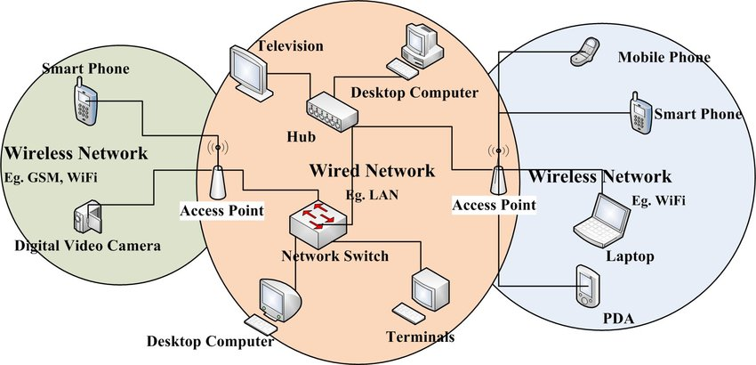

# RA06  
## Integració de sistemes operatius lliures i propietaris

Administració de Sistemes Operatius  
ASIX02

---

# Context de la integració de sistemes

En una xarxa real sovint conviuen:

- equips **Windows**
- servidors **Linux**
- impressores de xarxa
- clients amb sistemes diferents

Per això cal garantir la **interoperabilitat**: la capacitat que tenen sistemes diferents de comunicar-se, entendre’s i treballar junts

---

# Què vol dir integrar sistemes

Integrar sistemes operatius vol dir:

- connectar equips diferents dins d'una mateixa xarxa
- compartir recursos comuns
- accedir a serveis de manera compatible
- treballar de manera coordinada

Es tracta de que **es puguin entendre**

---

# 6.1 Concepte d'integració de sistemes operatius

La integració real apareix quan els equips poden:

- accedir a carpetes i fitxers compartits
- utilitzar impressores de xarxa
- autenticar-se i treballar amb permisos adequats

Això és el que anomenem **interoperabilitat**

---

# Exemple real

Una situació típica:

- usuaris amb **Windows**
- servidor principal amb **Linux**
- carpeta comuna en xarxa
- impressora compartida

La integració és correcta si tots els equips poden utilitzar aquests recursos

---

# 6.2 Escenaris heterogenis de xarxa

Un **escenari heterogeni** és una xarxa on conviuen equips diferents pel que fa a:

- sistema operatiu
- serveis instal·lats
- gestió de permisos
- manera d'accedir als recursos

És la situació més habitual en empreses i centres educatius

- Interoperabilitat = treballar junts
- Heterogeni = elements diferents

---

# Exemple d'escenari heterogeni



---

# 6.3 Recursos compartits en xarxa

Un **recurs compartit** és qualsevol element d'un sistema que es posa a disposició d'altres equips

Els més habituals són:

- carpetes
- fitxers
- impressores
- espais d'emmagatzematge

---

# Compartició d'arxius

Quan una carpeta del servidor es comparteix:

- els clients autoritzats hi poden entrar
- poden llegir documents
- poden modificar-los segons permisos
- la informació queda centralitzada

Això evita duplicacions i facilita el treball comú

---

# Compartició d'impressores

Una impressora compartida permet que diversos equips puguin imprimir sobre el mateix recurs.

Avantatges:

- menys maquinari duplicat
- administració centralitzada
- ús des de sistemes diferents

---

# 6.4 Seguretat d'accés als recursos compartits

Compartir un recurs no vol dir obrir-lo a tothom  

Cal veure:

- qui hi pot accedir
- què hi pot fer dins del recurs

La seguretat és clau tant en carpetes com en impressores compartides 

---

# Permisos habituals

En un recurs compartit poden aparèixer permisos com:

- **lectura**: r
- **lectura i escriptura**: rw
- **control total**: rwx

No tots els usuaris han de tenir el mateix nivell d'accés

---

# Usuaris i grups

Per controlar l'accés és habitual treballar amb:

- usuaris
- grups d'usuaris

Això simplifica la gestió i evita haver de configurar permisos un per un

---

# Idea clau de seguretat

En qualsevol recurs compartit s'hauria d'aplicar aquest criteri:

- donar només els permisos necessaris
- evitar permisos excessius
- separar usuaris que consulten dels que modifiquen

Això és el **principi de mínim privilegi**

---

# 6.5 Connectivitat en entorns heterogenis

Abans de compartir recursos, cal assegurar que client i servidor es poden comunicar.

Cal comprovar:

- adreçament IP correcte
- mateixa xarxa o ruta entre equips
- resolució de noms d’equips o servidors dins de la xarxa
- absència de bloquejos al tallafoc

---

# 6.6 Serveis de xarxa per compartir recursos

Per compartir carpetes o impressores no n'hi ha prou amb crear-les

Cal un **servei de xarxa** que actuï entre servidor i clients.

Els dos serveis principals són:

- **Samba**
- **CUPS**

---

# Servei vs recurs

És important diferenciar:

- **servei** → mecanisme que permet la compartició
- **recurs** → element concret que s'ofereix a la xarxa

Exemples:

- **Samba** → servei / carpeta compartida → recurs
- **CUPS** → servei / impressora → recurs

---

# 6.7 Samba

**Samba** és el servei més habitual quan un servidor Linux ha de compartir carpetes amb equips Windows

Permet:

- compartir directoris
- controlar l'accés amb usuaris
- definir permisos de lectura o escriptura
- integrar Linux i Windows dins d'una mateixa xarxa

---

# Què permet Samba tècnicament

- publicar carpetes a la xarxa
- validar l'accés dels usuaris
- fer visibles recursos Linux des de Windows i a l'inrevés
- mantenir control sobre permisos i accessos

---

# 6.8 Configuració de recursos compartits

Quan el servei ja està instal·lat, cal configurar el recurs que realment es vol oferir

Això implica decidir:

- què es compartirà
- qui pot accedir
- quins permisos tindrà qui accedeix

---

# Usuaris i autenticació

Un recurs compartit no s'hauria de deixar obert a tot o tothom

La compartició depèn de la relació entre:

- la carpeta real ha d’existir al servidor
- l’usuari ha d’estar definit i autoritzat
- el servei de compartició es qui convalida l'usuari
- els permisos del recurs han de permetre l’operació que l’usuari vol fer

---

# Configuració d'impressores compartides

En el cas de la impressió, el procés és semblant, però el servei principal és **CUPS**.

Primer cal:

- donar d’alta la impressora al sistema
- gestionar-la amb **CUPS**
- decidir si es comparteix en xarxa
- provar-la des dels clients

**CUPS** és el servei d’impressió de Linux i s’utilitza per administrar i compartir impressores.

---

# CUPS

**CUPS (Common Unix Printing System)** és el sistema d’impressió habitual en Linux

Serveix per:

- afegir impressores
- gestionar cues d’impressió
- compartir impressores en xarxa
- enviar treballs d’impressió

---

# 6.9 Proves de funcionament

Després d'instal·lar el servei i configurar el recurs, cal comprovar que tot funciona:

- accés des de sistemes diferents
- autenticació correcta
- lectura i escriptura quan toca
- ús real del recurs

---

# Proves sobre una carpeta compartida

Seqüència de comprovació:

- localitzar el servidor
- accedir al recurs compartit
- introduir credencials si cal
- comprovar lectura
- provar creació o modificació de fitxers

---

# Proves sobre impressores compartides

En una impressora compartida convé verificar:

- que el client la detecta
- que la pot afegir o connectar-hi
- que pot enviar una pàgina de prova
- que la cua de treball es processa correctament

---

# 6.10 Documentació de la configuració

Quan el servei ja funciona, cal documentar el que s'ha configurat

La documentació hauria d'incloure com a mínim:

- servei instal·lat
- servidor
- recurs compartit
- ruta real del recurs
- usuaris o grups autoritzats
- permisos aplicats
- proves realitzades

---

# Exemple simple de documentació per recurs compartit

```
Servei: Samba
Servidor: srv-linux
Recurs compartit: compartit
Ruta real: /srv/compartit
Usuaris autoritzats: professorat, administracio
Permisos: lectura i escriptura
Clients de prova: Windows 11, Ubuntu Desktop
Resultat de les proves: accés correcte i creació de fitxers verificada
```

---

# Exemple de documentació d'impressora

```
Servei: CUPS
Servidor: srv-linux
Impressora: aula1
Tipus d'accés: compartida en xarxa
Clients de prova: Windows 11, Ubuntu Desktop
Resultat: pàgina de prova impresa correctament
```

---

# Idea final

La interoperabilitat no és només una idea teòrica.

És un procés complet que passa per:

- entendre l'escenari heterogeni
- instal·lar i configurar serveis
- compartir recursos reals
- provar-los des de sistemes diferents
- documentar el resultat final
